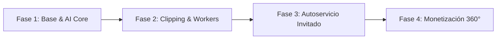

# 🎙️ Reporte Técnico Integral, Conectividad y Goals del Plan Original
> **Proyecto:** La Cueva del Güero & El Güero Bot (v2.5 PRO)  
> **Ubicación:** Mexicali, Baja California  
> **Fecha:** 2026-10-09  
> **Archivo de Texto Plano Complementario:** [`REPORTE_TECNICO_Y_GOALS_PLAN_ORIGINAL.txt`](file:///t:/LACUEVAWEB+ELGUEROBOT/REPORTE_TECNICO_Y_GOALS_PLAN_ORIGINAL.txt)

---

## 📌 Índice de Contenidos
1. [🌟 Resumen Ejecutivo y Visión del Proyecto](#1-resumen-ejecutivo-y-visión-del-proyecto)
2. [🐺 Equipo Canónico y Estructura de Roles](#2-equipo-canónico-y-estructura-de-roles)
3. [🎯 Goals y Metas Estratégicas del Plan Original (Fases 1 a 4)](#3-goals-y-metas-estratégicas-del-plan-original)
4. [📡 Conectividad con Plataformas de Streaming y Redes Sociales](#4-conectividad-con-plataformas-de-streaming-y-redes-sociales)
5. [⚙️ Inventario y Funcionalidad de APIs, Microservicios y Backend](#5-inventario-y-funcionalidad-de-apis-microservicios-y-backend)
6. [🎨 Evaluación y Auditoría de UI / UX](#6-evaluación-y-auditoría-de-ui--ux)
7. [💡 Áreas de Oportunidad y Recomendaciones por Sección](#7-áreas-de-oportunidad-y-recomendaciones-por-sección)
8. [📋 Matriz de Tareas Pendientes y Backlog Oficial (KANBAN)](#8-matriz-de-tareas-pendientes-y-backlog-oficial)
9. [🛡️ Arquitectura de Seguridad y Despliegue Híbrido](#9-arquitectura-de-seguridad-y-despliegue-híbrido)

---

## 1. Resumen Ejecutivo y Visión del Proyecto
**La Cueva del Güero** es una plataforma tecnológica integral diseñada para transformar un podcast independiente en una **cadena de medios transmedia automatizada**, reduciendo más de **15 horas semanales** de trabajo manual por episodio y multiplicando su alcance orgánico de **3x a 5x**.

### Componentes Clave:
* **Landing Page Inmersiva:** Estética Cyberpunk con motor de partículas HTML5 a 60 FPS, avatares sincronizados y muro social interactivo.
* **Paw Agent / El Güero Bot:** Agente de IA 24/7 con personalidad norteña urbana y RAG sobre episodios pasados.
* **Preproducción Inteligente:** Cuestionarios dinámicos, tracking en vivo de invitados en 5 fases, escaletas broadcast y cue cards para tablet.
* **Postproducción con IA:** Normalización acústica (-14 LUFS), Demucs, detección de silencios y generador de clips verticales 9:16.
* **Diseño Gráfico Integrado:** Canva PRO Cyberpunk con remoción de fondos y conexión a nubes de almacenamiento.
* **Blindaje Legal:** Contratos digitales de cesión de derechos firmados y exportados a PDF.

---

## 2. Equipo Canónico y Estructura de Roles
*(Documentado en [`docs/EQUIPO_CANONICO.md`](file:///t:/LACUEVAWEB+ELGUEROBOT/docs/EQUIPO_CANONICO.md))*

| Integrante / Personaje | Rol Oficial | Funciones y Responsabilidades Principales |
| :--- | :--- | :--- |
| **"El Güero" (El Perro)** | Mascota Oficial & Espíritu de Marca | Identidad visual, inspiración del show, imagen del set y voz del Paw Agent con personalidad norteña leal. |
| **Ariel Higuera "El Junior"** | CEO & Conductor Principal (Host) | Rostro y voz principal, conducción de entrevistas, lectura de Cue Cards en tablet y relaciones públicas. |
| **Maria Elena Anguiano "La Mary"** | Socia Ángel & Administradora de Finanzas | Inversión de capital, presupuestos de set/producción y cierre de acuerdos con patrocinadores comerciales. |
| **Javier Gallardo "El Gallo"** | Socio Intelectual, Director Creativo & Productor | Arquitectura narrativa, curaduría de invitados, dirección de cabina/piso, dinámicas de preguntas y postproducción. |

---

## 3. Goals y Metas Estratégicas del Plan Original

### Goal 1: Suite de Preproducción y CRM de Invitados
* Cuestionario interactivo de storytelling ([`storytelling-invitado.html`](file:///t:/LACUEVAWEB+ELGUEROBOT/storytelling-invitado.html)).
* Portal de tracking en vivo de 5 fases ([`tracking/index.html`](file:///t:/LACUEVAWEB+ELGUEROBOT/tracking/index.html)).
* Guión broadcast de 6 bloques con timecodes ([`api/api-guion.php`](file:///t:/LACUEVAWEB+ELGUEROBOT/api/api-guion.php)).
* Escaletas de cabina estructuradas con IA ([`api/api-escaleta.php`](file:///t:/LACUEVAWEB+ELGUEROBOT/api/api-escaleta.php)).
* Cue Cards A5 de alto contraste para tablet de cabina ([`api/api-cuecards.php`](file:///t:/LACUEVAWEB+ELGUEROBOT/api/api-cuecards.php)).
* Firma y exportación PDF de cesión de derechos de imagen ([`cesion-derechos.html`](file:///t:/LACUEVAWEB+ELGUEROBOT/cesion-derechos.html)).

### Goal 2: Postproducción Acelerada con IA (Video & Audio)
* Aislamiento de voz y masterización broadcast a **-14 LUFS** con Demucs y FFmpeg ([`api/api-video-process.php`](file:///t:/LACUEVAWEB+ELGUEROBOT/api/api-video-process.php)).
* Detección de silencios y edición basada en texto ([`api/api-text-based-editor.php`](file:///t:/LACUEVAWEB+ELGUEROBOT/api/api-text-based-editor.php)).
* Extracción automática de momentos virales y clips en 9:16 ([`api/api-video-clips.php`](file:///t:/LACUEVAWEB+ELGUEROBOT/api/api-video-clips.php)).
* Desacoplamiento de procesamiento a contenedores escalables en **Google Cloud Run** ([`docs/GUIA_GOOGLE_CLOUD_RUN_VIDEO.md`](file:///t:/LACUEVAWEB+ELGUEROBOT/docs/GUIA_GOOGLE_CLOUD_RUN_VIDEO.md)).

### Goal 3: Distribución Transmedia y Viralidad
* Generador de ganchos (hooks) con neuro-marketing de 3 segundos para TikTok/Shorts ([`api/api-hooks-ai.php`](file:///t:/LACUEVAWEB+ELGUEROBOT/api/api-hooks-ai.php)).
* Artículos de blog SEO completos redactados automáticamente a partir de transcripciones ([`api/api-blog-ai.php`](file:///t:/LACUEVAWEB+ELGUEROBOT/api/api-blog-ai.php)).
* Muro social multicanal en vivo (YouTube, Spotify, Meta, TikTok) dentro de la landing page.
* Sincronización continua de métricas con la API de YouTube ([`api/api-youtube-analytics.php`](file:///t:/LACUEVAWEB+ELGUEROBOT/api/api-youtube-analytics.php)).

### Goal 4: Experiencia Digital Inmersiva & El Güero Bot
* Hero cinemático con motor de partículas HTML5 neón a 60 FPS y avatares con caminata/sentada dinámica.
* Asistente conversacional 24/7 con RAG contextual y captación de leads ([`api/api-el-guero-bot.php`](file:///t:/LACUEVAWEB+ELGUEROBOT/api/api-el-guero-bot.php)).
* Mapa interactivo de la manada (SVG con zoom/pan y colocación de pines luminosos).
* Calificación de flujo por emojis y captura de reseñas del público.

### Goal 5: Suite de Diseño Gráfico Canva PRO Cyberpunk
* Editor canvas multipista con capas, tipografías neón y stickers oficiales.
* Remoción automática de fondo con IA.
* Cloud Picker con Google Drive, Dropbox, OneDrive y TeraBox ([`api/api-drive-oauth.php`](file:///t:/LACUEVAWEB+ELGUEROBOT/api/api-drive-oauth.php)).
* Generador de avatares e ilustraciones neón con Google Imagen 3 ([`api/api-avatar-engine.php`](file:///t:/LACUEVAWEB+ELGUEROBOT/api/api-avatar-engine.php)).

---

## 4. Conectividad con Plataformas de Streaming y Redes Sociales

| Plataforma | Tipo de Conexión | Endpoints / Módulos Involucrados | Funcionalidad y Estado |
| :--- | :--- | :--- | :--- |
| **YouTube** | Data API v3 & Analytics | `api-youtube-latest.php`, `youtube-analytics.js` | Detección de último video, cache anti-cuota y consulta de métricas de visualización. |
| **Spotify** | Web Playback Embed | `index.html` (Iframe reactivo) | Reproducción embebida; pendiente integración con API de publicación automática. |
| **Kick** | API v1/v2 & Pusher | Clúster Pusher WebSocket | Escucha de eventos de chat y alertas de transmisión. |
| **TikTok** | Webcast Connector | Muro Social & `api-video-clips.php` | Captura de eventos en vivo y exportación directa de clips 9:16. |
| **Meta (IG/FB)** | Graph API & Social Wall | Muro multicanal en `index.html` | Visualización en vivo de reels, posts y contenido derivado. |
| **Discord** | Gateway v10 & Webhooks | Webhooks de alertas | Notificación automática con embeds al iniciar directos y sincronización de roles. |
| **X (Twitter)** | Twitter API v2 | Módulo de difusión | Publicación automatizada de tweets de aviso de estreno y clips virales. |

---

## 5. Inventario y Funcionalidad de APIs, Microservicios y Backend

* **`api-el-guero-bot.php` / `guero-bot.js`:** Motor conversacional con personalidad norteña urbana y balanceador de Gemini API.
* **`api-guero-knowledge.php` / `guero-knowledge.js`:** Base de conocimiento RAG con la historia del podcast, invitados y anécdotas.
* **`api-guest-tracking.php`:** Consulta y avance del estado del invitado en las 5 fases del pipeline con soporte para compartir por WhatsApp.
* **`api-escaleta.php` / `ai-escaleta.js`:** Generación automatizada de escaletas de grabación basadas en el cuestionario de storytelling.
* **`api-guion.php`:** Generador de guiones broadcast de 6 bloques cinematográficos.
* **`api-cuecards.php`:** Generador y visualizador de tarjetas A5 de alto contraste para tablet en set.
* **`api-hooks-ai.php` / `ai-hooks.js`:** Generador de ganchos virales con neuro-marketing y fórmulas de retención.
* **`api-invitados-save.php` / `api-invitados-get.php`:** Guardado y consulta persistente de respuestas de invitados.
* **`api-export-pdf.php`:** Generador de documentos PDF para contratos de cesión de derechos y escaletas.
* **`api-avatar-engine.php` / `api-imagen-generator.php`:** Generador de avatares con Google Imagen 3.
* **`api-video-process.php` / `api-cloud-video.php`:** Pipeline de postproducción de video/audio (-14 LUFS, Demucs) y orquestación en Cloud Run.
* **`api-video-clips.php`:** Extractor de momentos clave y clips virales 9:16 para redes sociales.
* **`api-blog-ai.php` / `upload-blog.php`:** Generador de artículos de blog SEO a partir de transcripciones.
* **`api-auth.php`:** Autenticación segura de administradores para el Dashboard PRO.
* **`config/config.php` / `api/_gemini.js`:** Configuración global, rotación de claves Gemini y conexión a base de datos.

---

## 6. Evaluación y Auditoría de UI / UX

### A. Landing Page (`index.html`)
* **Puntos Fuertes:** Estética Cyberpunk cohesiva, animaciones fluidas a 60 FPS, avatares sincronizados, selector de flow con emojis y muro social unificado.
* **Área de Mejora:** Optimizar la carga diferida (*lazy loading*) de miniaturas e iframes para conexiones móviles 3G/4G.

### B. Dashboard PRO (`dashboard/index.html` & `index.php`)
* **Puntos Fuertes:** Panel multipestaña de alta densidad informativa, integración de todas las herramientas de pre y postproducción.
* **Área de Mejora:** Implementar notificaciones tipo toast no bloqueantes al guardar cambios y modo de alto contraste para cabina.

### C. Portal de Tracking (`tracking/index.html`)
* **Puntos Fuertes:** Barra de progreso visual clara de 5 fases, modal de recuperación de enlace y botón instantáneo de WhatsApp.
* **Área de Mejora:** Notificaciones automáticas por webhook de WhatsApp al cambiar de fase.

### D. Editor Canva PRO (`js/editor-canva.js`)
* **Puntos Fuertes:** Edición en cliente sin software externo, stickers neón y eliminación de fondos con IA.
* **Área de Mejora:** Sistema de historial Undo/Redo multinivel y presets de exportación en proporciones 16:9 y 9:16.

---

## 7. Áreas de Oportunidad y Recomendaciones por Sección

1. **Streaming & Conectividad:** Implementar reconexión con *exponential backoff* en WebSockets/Pusher y cola FIFO para alertas de OBS.
2. **Redes Sociales:** Deduplicación de avisos de streaming en los primeros 10 minutos para evitar publicaciones repetidas ante caídas de conexión.
3. **Backend & Base de Datos:** Cifrado AES-256 en reposo para tokens OAuth y migración del RAG a `pgvector` en PostgreSQL.
4. **Cabina & Set:** Implementación de la API Screen WakeLock en las Cue Cards para evitar que la tablet se bloquee durante la entrevista.

---

## 8. Matriz de Tareas Pendientes y Backlog Oficial (KANBAN)

*(Extraído del tablero oficial [`KANBAN.md`](file:///t:/LACUEVAWEB+ELGUEROBOT/KANBAN.md))*

| Código | Módulo | Tarea Pendiente | Prioridad | Estado |
| :--- | :--- | :--- | :--- | :--- |
| **TSK-B1** | **SSO / Acceso** | Conexión del inicio de sesión (SSO) unificado con la Landing de TSolutions | 🟡 Media | 📥 Backlog |
| **TSK-B2** | **Monetización** | Módulo de pagos y suscripción recurrente con Stripe para Club VIP de miembros | 🟡 Media | 📥 Backlog |
| **TSK-R1** | **Cloud Video** | Pruebas de carga y estrés concurrentes en el pipeline de video distribuido en Cloud Run | 🔴 Alta | 📌 Ready / To Do |
| **TSK-R2** | **Distribución** | Integración directa con la API de publicación automática de Spotify for Podcasters | 🟡 Media | 📌 Ready / To Do |
| **TSK-P1** | **Gemini AI** | Monitoreo continuo de cuotas y rendimiento del balanceador de claves Gemini en producción | ⚡ En Curso | ⚡ In Progress |

---

## 9. Arquitectura de Seguridad y Despliegue Híbrido

* **Seguridad en Profundidad:**
  * **Capa 1 (Apache):** Bloqueo en [`.htaccess`](file:///t:/LACUEVAWEB+ELGUEROBOT/.htaccess) de archivos críticos (`.env`, `.git`, `config.php`, backups) y desvío de patrones SQL Injection en la URL.
  * **Capa 2 (Headers):** Cabeceras estrictas de HSTS, CSP, X-Frame-Options y X-Content-Type-Options.
  * **Capa 3 (Backend):** Consultas preparadas con PDO y sanitización exhaustiva.
  * **Capa 4 (Secretos):** Rotación de múltiples API keys de Gemini para evitar agotamiento de cuotas.
* **Entornos de Despliegue:**
  * **Hostinger:** Servidor Apache con PHP y base de datos MySQL.
  * **Vercel:** Despliegue serverless con Node.js v24 y enrutamiento especializado en [`vercel.json`](file:///t:/LACUEVAWEB+ELGUEROBOT/vercel.json).
  * **Google Cloud Run:** Contenedor Docker para tareas intensivas de procesamiento de video (FFmpeg, Demucs, Whisper).
